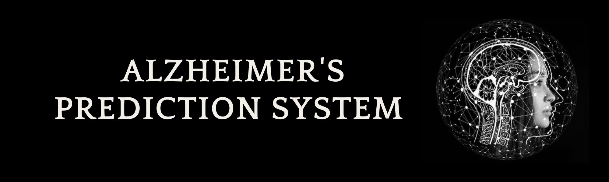

# Alzheimer's Disease Prediction  
  

## Table of Contents  
- [Introduction](#introduction)  
- [Setup Instructions](#setup-instructions)  
  - [Prerequisites](#prerequisites)  
- [Usage Guide](#usage-guide)  
  - [Data Input](#data-input)  
- [Additional Information](#additional-information)  
  - [Model Details](#model-details)  
  - [Dataset](#dataset)  
- [Deployment](#deployment)  
- [Developer](#developer)  

## Introduction  
Alzheimer's disease is a complex neurodegenerative disorder that affects millions of people worldwide. Early detection and prediction of Alzheimer's can lead to better management and treatment outcomes. This prediction system utilizes a machine learning model trained on a dataset of relevant features to provide predictions about the likelihood of Alzheimer's disease.  

### About Alzheimer's Disease  
Alzheimer's disease (AD) is a progressive neurodegenerative condition primarily affecting memory, cognition, and behavior. Symptoms include difficulty thinking, decision-making, and performing daily tasks. The exact causes of AD are not fully understood, but genetic factors like the APOE e4 allele are known to increase risk.  

### Purpose of the Project  
This project aims to develop a machine learning model for the early prediction of Alzheimer's disease. Early detection is crucial for better patient care and potential intervention strategies.  

### Potential Impact  
- Early detection can help slow disease progression through timely interventions.  
- Accurate prediction models assist in selecting participants for clinical trials and research.  
- Raising awareness about Alzheimer's disease and encouraging proactive medical consultation.  

## Setup Instructions  
(Ignore if you do not want to run the application locally)  

### Prerequisites  
Ensure you have the following installed:  
- Python (>= 3.6)  
- pip (Python package manager)  

### Installation  
1. Clone the repository:  
   ```bash
   git clone https://github.com/your-repo/Alzheimers_Prediction_System.git  
   cd Alzheimers_Prediction_System  
   ```  

2. Create a virtual environment (recommended):  
   ```bash
   python3 -m venv venv  
   source venv/bin/activate  
   ```  

3. Install the required dependencies:  
   ```bash
   pip install -r requirements.txt  
   ```  

## Usage Guide  

### Data Input  
1. Go to the [web application](https://alzheimers-prediction.streamlit.app) and navigate to the prediction section.  
2. Upload the required MRI image or enter clinical data.  
3. The system will analyze the data and provide a prediction on Alzheimer's likelihood.  

## Additional Information  

### Model Details  
- **Algorithm**: Convolutional Neural Network (CNN)  
- **Purpose**: Multi-class classification for different stages of Alzheimer's  
- **Input Features**: MRI scan images, clinical risk factors, cognitive test scores  

### Dataset  
The model is trained on a dataset from [Alzheimer’s Disease Neuroimaging Initiative (ADNI)](https://adni.loni.usc.edu), which includes imaging, clinical, and genetic data.  

## Deployment  
The Alzheimer's prediction model is deployed on:  
- **Streamlit**: [Visit Site](https://alzheimers-prediction.streamlit.app)  
- **Hugging Face Spaces**: [Visit Site](https://huggingface.co/spaces/your-space)  

## Developer  
This project is developed and maintained by **Adilan Akhramovich**.  
For inquiries and support, contact me at [adilan.akhramovich@gmail.com](mailto:adilan.akhramovich@gmail.com).  
